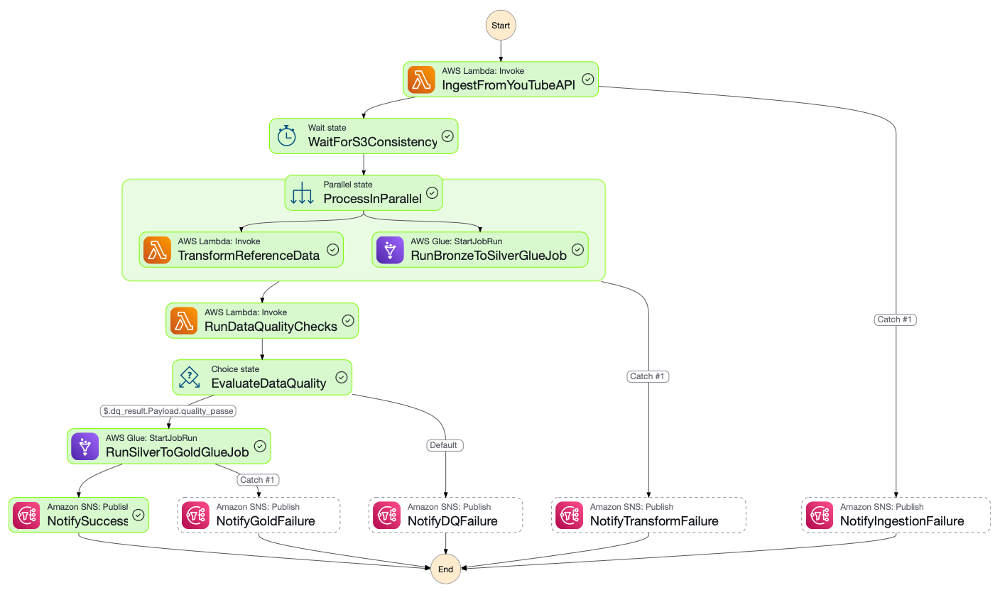

# YouTube Data Pipeline 2026

## Overview

This repository contains a YouTube data pipeline that moves raw country-specific metadata from a bronze S3 landing zone into a silver analytics layer. It converts raw CSV and JSON files into cleaned Parquet output and supports Glue catalog registration for downstream analytics.

## Repository Structure

- `data/`
  - Raw country-specific files uploaded from the YouTube Kaggle dataset
  - Example files include `INvideos.csv`, `US_category_id.json`, etc.

- `scripts/`
  - `aws_copy.sh` — copies CSV files to the bronze statistics path and JSON files to the bronze reference data path, preserving region folders
  - `information.md` — pipeline bucket names, Glue catalog references, and example Glue job parameters

- `lambda/`
  - `json_to_parquet/lambda_function.py` — Lambda function for converting raw JSON reference data into partitioned Parquet in the silver bucket
  - `youtube_api_ingestion/lambda_function.py` — ingestion Lambda for YouTube API or raw data capture workflows

- `glue_jobs/`
  - `bronze_to_silver_statistics.py` — Glue job to transform bronze statistics data into silver statistics data
  - `silver_to_gold_analytics.py` — Glue job for analytics-ready gold layer output

- `data_quality/`
  - `dq_lambda.py` — data quality checks and validation logic for the pipeline

- `pipeline/`
  - `YouTube Trending Data Pipeline.png` — high-level architecture diagram for the pipeline

- `iam_permissions/step_functions/`
  - `stepfunctions_graph.png` — final Step Functions execution diagram

## Architecture Diagrams

### Pipeline architecture


### Step Functions execution



## Key Buckets and Paths

- Bronze statistics: `s3://yt-data-pipeline-bronze-us-east-1a-dev/youtube/raw_statistics`
- Bronze reference data: `s3://yt-data-pipeline-bronze-us-east-1a-dev/youtube/raw_statistics_reference_data`
- Silver output: `s3://yt-data-pipeline-silver-us-east-1a-dev/youtube/reference_data/`

## Local Setup

1. Create and activate a virtual environment:

```bash
python3 -m venv .venv
source .venv/bin/activate
```

2. Install required packages:

```bash
pip install awswrangler pandas boto3 pyarrow
```

3. Keep the virtual environment out of Git:

`.gitignore` already includes `.venv/`.

## How the pipeline works

1. Raw CSV and JSON files are stored locally in `data/`.
2. `scripts/aws_copy.sh` uploads CSV files to the bronze statistics path and JSON files to the bronze reference data path.
3. A Lambda function in `lambda/json_to_parquet/lambda_function.py` converts incoming bronze JSON into cleaned Parquet output and writes it to the silver bucket.
4. Glue jobs under `glue_jobs/` perform further transformations from bronze → silver → gold.
5. Optional data quality validation is implemented in `data_quality/dq_lambda.py`.

## Deploying Lambda on AWS

- Use Python 3.12 runtime or a compatible version.
- Set the Lambda handler to `lambda_function.lambda_handler`.
- Provide the following environment variables:
  - `S3_BUCKET_SILVER`
  - `GLUE_DB_SILVER`
  - `GLUE_TABLE_REFERENCE`
  - `SNS_ALERT_TOPIC_ARN`

- If using `awswrangler`, include a deployment package or Lambda layer with dependencies.
- For production, prefer packaging dependencies with your function or using a managed layer.

## Notes

- `awswrangler` is used for Glue-managed Parquet writes when working with pandas DataFrames.
- For raw S3 read/write without `awswrangler`, you can use `boto3` + `pyarrow`.
- Keep the project repo clean by not checking in virtual environments or generated deployment packages.

## Contact

If you need help updating deployment packaging or configuring Glue/AWS Lambda triggers, open the repository and I can help with the next step.
